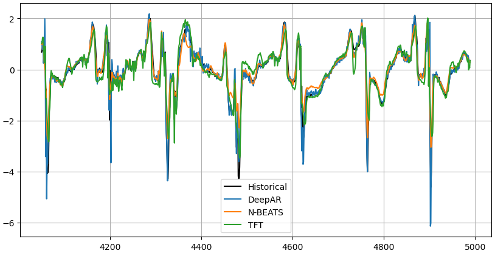

# Deep Learning Forecasting

This repository contains a Python wrapper script that applies three Deep Learning model:

* DeepAR
* N-BEATS
* Temporal Fusion Transformer

and generates predictions and metrics on time-series data.

## An example

As an example, a public dataset containing healthy and pathological ECG waves was used. 10000 healthy samples were concatenated and used in order to generate the predictions and metrics shown below. The file containing the data is ```ecg_normal_filas_10000.csv```.



|MAPE|$R^2$  |MAE |RMSE|MBE  |Pearson|Model |
|----|----|----|----|-----|-------|------|
|1.96|0.89|0.19|0.33|-0.07|0.96   |NBEATS|
|1.48|0.86|0.17|0.35|-0.004 |0.93   |DeepAR   |
|4.34|0.85|0.22|0.39|-0.004|0.92   |TFT|

## Usage

The script allows for performing both univariate and multivariate analysis. In the case of the latter, covariates must be specified in their appropriate lists within the script.
